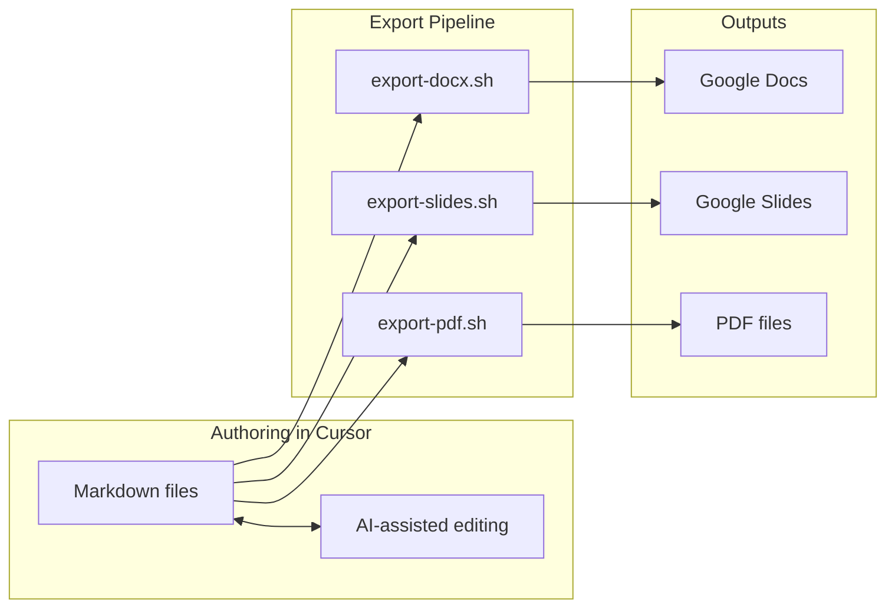

# AI-Friendly Articles Repository Setup

## Target Structure

```
ai-articles/
├── README.md                    # Repo overview, quickstart, tooling
├── .cursorrules                 # AI context for Cursor sessions
├── GLOSSARY.md                  # Domain terms across all topics
├── scripts/
│   ├── export-docx.sh           # Markdown → DOCX (for Google Docs)
│   ├── export-slides.sh         # Marp → PPTX (for Google Slides)
│   ├── export-pdf.sh            # Markdown → PDF
│   └── export-all.sh            # Batch export for a topic
├── templates/
│   ├── article.md               # Article template with front-matter
│   ├── slides.md                # Marp presentation template
│   └── research.md              # Research/notes template
├── epistemic_debt/              # (migrate existing content)
│   ├── README.md                # Topic overview, status, links
│   ├── article.md               # Main article draft
│   ├── slides.md                # Marp presentation
│   ├── raw_material/            # (existing) working notes
│   ├── references/              # (existing) literature
│   ├── assets/                  # Images, diagrams
│   └── exports/                 # Generated DOCX, PPTX, PDF
└── [future-topics]/
```

---

## 1. Repository Foundation

### README.md

- Purpose and scope of the repository
- Prerequisites (pandoc, marp-cli)
- Quickstart: how to create a new topic
- Export workflow instructions
- Folder conventions

### GLOSSARY.md

- Shared terminology across topics
- AI can reference this for consistent language
- Initial terms from epistemic debt (e.g., "epistemic debt", "epistemic warrant", "solutioning trap")

---

## 2. Export Toolchain Scripts

### scripts/export-docx.sh

- Uses `pandoc` to convert article.md to DOCX
- Preserves front-matter as document properties where possible
- Output to `<topic>/exports/`

```bash
# Usage: ./scripts/export-docx.sh epistemic_debt
pandoc "$1/article.md" -o "$1/exports/article.docx" \
  --from=markdown --to=docx --standalone
```

### scripts/export-slides.sh

- Uses `marp` CLI to convert slides.md to PPTX
- Supports themes and speaker notes

```bash
# Usage: ./scripts/export-slides.sh epistemic_debt
marp "$1/slides.md" -o "$1/exports/slides.pptx" --allow-local-files
```

### scripts/export-pdf.sh

- Dual mode: article PDF (via pandoc) and slides PDF (via marp)
- Article uses a clean template

```bash
# Usage: ./scripts/export-pdf.sh epistemic_debt [article|slides|both]
```

### scripts/export-all.sh

- Wrapper that runs all exports for a topic
- Creates exports/ directory if missing

---

## 3. AI-Friendly Authoring Files

### .cursorrules

Will include three sections:

**Writing Style Guidelines:**

- Tone: exploratory, not prescriptive
- Audience awareness (technical but accessible)
- Avoid jargon without definition
- Preferred sentence structures

**Content Structure Conventions:**

- Front-matter format (YAML)
- Section heading hierarchy
- How to mark gaps/TODOs (e.g., `[GAP: description]`)
- Citation format for references

**Domain Terminology:**

- Reference to GLOSSARY.md
- Key concepts and their definitions
- Terms to avoid or clarify

### templates/article.md

Front-matter structure:

```yaml
---
title: ""
status: draft | review | published
type: article
audience: []
target_length: 0
created: YYYY-MM-DD
last_updated: YYYY-MM-DD
---
```

Sections: Abstract, Introduction, Body placeholders, Conclusion, References

### templates/slides.md

Marp-compatible with:

```yaml
---
marp: true
theme: default
paginate: true
title: ""
---
```

Sample slide structure with speaker notes syntax

### templates/research.md

For raw material and notes:

- Source tracking
- Key quotes section
- Questions/gaps section
- Connection to other topics

---

## 4. Migrate Existing Content

Reorganize `epistemic_debt/` to match new structure:

- Keep `raw_material/` and `references/` as-is
- Create `article.md` from outline (or keep outline in raw_material)
- Add topic-level `README.md`
- Create `slides.md` placeholder
- Create `exports/` and `assets/` directories

---

## Workflow Diagram




