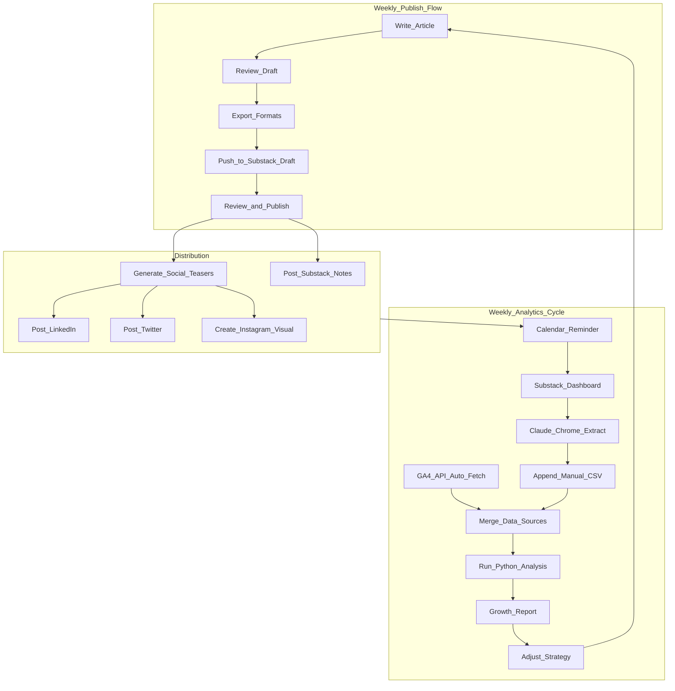

# Substack Publication & Distribution Workflow

## Context

- **Primary publication**: [The AI Mirror](https://antoninorau.substack.com/) on Substack
- **Current subscribers**: 26-50, **Goal**: 100
- **Publishing cadence**: Weekly
- **Distribution channels**: Substack (primary) -> LinkedIn, Twitter/X, Instagram (promotion)
- **Analytics**: Semi-manual CSV-based data collection (Claude Chrome plugin + calendar reminders) with Python analysis scripts

---

## Phase 1: Update All Documentation Files ✅ COMPLETED

Every AI rules/docs file currently has zero mention of Substack or social media. Add a **Publication & Distribution** section to each.

> **Status**: Completed via Phase 1 sub-plan (`phase1_substack_docs_66897fd3.plan.md`). Implemented as centralized `.ai/` directory with symlink architecture instead of inline edits to `.cursorrules`/`CLAUDE.md`. See commits `3c7b604` (baseline) and `a87c2cf` (Phase 1 implementation).

### Files to Update

**Core AI context files** (add publication target + distribution info):

- `[.cursorrules](.cursorrules)` -- Add a new top-level section "Publication & Distribution Target" with Substack URL, audience description, social media channels, and AI assistant guidelines for drafting social teasers
- `[CLAUDE.md](CLAUDE.md)` -- Add publication target, distribution workflow summary, MCP server references
- `[README.md](README.md)` -- Add "Publication" section explaining the Substack destination, social media promotion, and end-to-end workflow

**Planning/GSD files** (use `gsd-codebase-mapper` subagent):

- `[.planning/codebase/ARCHITECTURE.md](.planning/codebase/ARCHITECTURE.md)` -- Add a **Distribution Layer** above the Export Layer: Substack draft creation, social media teasers, analytics feedback loop
- `[.planning/codebase/INTEGRATIONS.md](.planning/codebase/INTEGRATIONS.md)` -- Add MCP server integrations (Substack MCP, Crosspost, browser-use for analytics)
- `[.planning/codebase/STACK.md](.planning/codebase/STACK.md)` -- Add MCP servers and social media tools to the technology stack
- `[.planning/codebase/STRUCTURE.md](.planning/codebase/STRUCTURE.md)` -- Document new directories/files for distribution workflow
- `[.planning/codebase/CONVENTIONS.md](.planning/codebase/CONVENTIONS.md)` -- Add publishing conventions (teaser format, hashtag strategy, posting schedule)
- `[.planning/codebase/CONCERNS.md](.planning/codebase/CONCERNS.md)` -- Add concerns about token security, API fragility, analytics limitations

**Content files**:

- `[GLOSSARY.md](GLOSSARY.md)` -- Add distribution terms (cross-posting, teaser, CTA, Substack Notes, social proof)
- `[templates/article.md](templates/article.md)` -- Add `publication_url`, `social_teaser`, and `distribution_channels` to YAML front-matter

### Key Content to Add Across Files

```yaml
# Publication target (for front-matter and docs)
publication:
  platform: Substack
  url: https://antoninorau.substack.com/
  name: "The AI Mirror"
  tagline: "AI, philosophy, and spirituality"
distribution:
  - platform: LinkedIn
  - platform: Twitter/X
  - platform: Instagram
goal: 100 subscribers
```

---

## Phase 2: MCP Server Configuration ✅ COMPLETED

> **Status**: Completed via Phase 2 sub-plan (`phase2_mcp_setup_0ab60c03.plan.md`). Created comprehensive setup documentation (`docs/mcp-setup.md`), config template (`.mcp.json.example`), credentials directory (`analytics/credentials/.gitkeep`), and updated `.ai/rules/publication.md` to reference the new docs. Documentation-only scope — no credentials configured yet. See commit `93e4c04`.

### 2a. Substack MCP (Draft Creation)

- **Server**: `marcomoauro/substack-mcp` (free, NPX-based)
- **Capability**: `create_draft_post` (title, subtitle, body)
- **Setup**: Add MCP config to Cursor settings; document credential extraction (session token, publication URL, user ID) in a setup guide
- **Workflow**: AI writes article in repo -> exports to Substack as draft -> author reviews and publishes manually

### 2b. Social Media Cross-Posting MCP

- **Server**: `@humanwhocodes/crosspost` (free, OSS, NPX-based)
- **Platforms**: Twitter/X (`-t`), LinkedIn (`-l`), plus others
- **Instagram gap**: Crosspost does NOT support Instagram. For Instagram, recommend manual posting or Late API upgrade later.
- **Workflow**: After Substack publish, AI generates platform-specific teasers -> posts via Crosspost MCP

### 2c. Google Analytics 4 MCP (Automated Analytics)

- **Server**: `google-analytics-mcp` (Python, pip-installable from PyPI)
- **GA4 Property**: `361268692` (from URL `a54734855p361268692`)
- **GA link**: [https://analytics.google.com/analytics/web/#/a54734855p361268692/reports/intelligenthome](https://analytics.google.com/analytics/web/#/a54734855p361268692/reports/intelligenthome)
- **Capabilities via MCP**: Ask Claude natural-language questions like "Show traffic sources for the last 7 days" or "Which articles had the most views this month?" and get GA4 data directly
- **Capabilities via Python API**: `google-analytics-data` library for automated batch data pulls into CSV/pandas
- **Setup**: Create GCP service account, enable GA4 Data API, grant access to property, download JSON credentials (gitignored)

**What GA4 automates** (no manual collection needed):

- Page views, sessions, unique users per article
- Traffic sources / referral channels (LinkedIn, Twitter, direct, organic search, Substack)
- User behavior: bounce rate, avg session duration, scroll depth
- Geographic and device breakdown
- Real-time traffic monitoring (useful right after social posts)

**What GA4 does NOT cover** (still semi-manual):

- Substack subscriber counts (free/paid split)
- Email open rates and click rates
- Substack-native engagement (restacks, Substack likes)
- Social media post engagement (likes/comments on the LinkedIn/Twitter posts themselves)

### 2d. Semi-Manual Data Collection (Substack + Social Media)

For metrics GA4 cannot capture, use a tiered approach:

**Tier 1 -- Calendar + Checklist (immediate)**:

- Weekly calendar reminder (e.g., Sunday evening) to open Substack dashboard
- Structured checklist of ONLY the metrics GA4 cannot provide
- Takes ~3 minutes per week (reduced scope thanks to GA4 automation)

**Tier 2 -- Claude Chrome Plugin (current)**:

- Open Substack dashboard in Chrome, activate Claude extension
- Use a saved prompt that asks Claude to extract subscriber counts, email open rates, restacks
- Claude reads the dashboard DOM and outputs structured data (CSV-ready)
- You paste/append to the CSV files in the repo
- Same for social media analytics pages (LinkedIn post analytics, Twitter analytics)

**Tier 3 -- Browser-use MCP (eventual)**:

- Full automation via `browser-use` subagent in Cursor
- Fragile but hands-free; keep as an option, not the primary path

### MCP Config Structure

Three MCP servers to configure in Cursor:

```json
{
  "mcpServers": {
    "substack-api": {
      "command": "npx",
      "args": ["-y", "substack-mcp@latest"],
      "env": { "SUBSTACK_PUBLICATION_URL": "...", "SUBSTACK_SESSION_TOKEN": "...", "SUBSTACK_USER_ID": "..." }
    },
    "crosspost": {
      "command": "npx",
      "args": ["@humanwhocodes/crosspost", "-t", "-l", "--mcp"],
      "env": { "CROSSPOST_DOTENV": "/path/to/.env" }
    },
    "google-analytics": {
      "command": "python",
      "args": ["-m", "google_analytics_mcp"],
      "env": { "GA4_PROPERTY_ID": "361268692", "GOOGLE_APPLICATION_CREDENTIALS": "/path/to/credentials.json" }
    }
  }
}
```

Create a documented example config (NOT committed to git, added to `.gitignore`):

```
.mcp.json                       # Cursor MCP config (gitignored)
analytics/credentials/           # GCP service account JSON (gitignored)
.env                            # Social media API keys (gitignored)
docs/mcp-setup.md               # Setup instructions (committed)
```

---

## Phase 3: Publishing Workflow Documentation ✅ COMPLETED

> **Status**: Completed. Created `docs/publishing-workflow.md` (weekly cycle, mermaid diagram, growth playbook, references) and `templates/social-teasers.md` (platform-specific conventions, examples, fill-in templates for LinkedIn, Twitter/X, Instagram, Substack Notes). Updated `.ai/rules/publication.md` to reference both files.

Create a new workflow document that codifies the end-to-end process:

### Weekly Publishing Workflow




### Social Media Teaser Templates

Add templates/conventions for each platform:

- **LinkedIn**: Professional framing, 1-3 paragraph teaser, link to Substack, relevant hashtags
- **Twitter/X**: Hook + key insight + link, thread option for longer pieces
- **Instagram**: Quote card or key visual + caption with CTA to "link in bio"
- **Substack Notes**: Native promotion, engage with other writers

### Growth Tactics to Codify

- Post Substack Notes daily/regularly (organic discovery)
- Engage with other writers in the AI/philosophy niche
- Enable and actively manage Substack Recommendations
- Rotate cross-recommendation partners
- Use each article's most provocative claim as the social media hook

---

## Phase 4: New Templates and Conventions ✅ COMPLETED

> **Status**: Completed via Phase 4 sub-plan (`phase_4_templates_conventions_24df1c31.plan.md`). Backfilled YAML front-matter (including new `current_length` field) for Articles 0-7, updated `templates/article.md` with `current_length`, created `scripts/validate-frontmatter.py` for schema validation of all Markdown files with front-matter, and added repo-level `requirements.txt` with `pyyaml`. Validation passes on all 8 articles and 3 templates.

### Updated Article Front-Matter

```yaml
---
title: "Article Title"
status: draft | review | published
type: article
audience: [Substack subscribers, tech professionals]
target_length: 1500
created: YYYY-MM-DD
last_updated: YYYY-MM-DD
published_date: YYYY-MM-DD
publication_url: ""  # filled after publishing
social_teasers:
  linkedin: ""
  twitter: ""
  instagram_caption: ""
  substack_notes: ""
---
```

### New Template: Social Teaser Template

Create `templates/social-teasers.md` with platform-specific teaser structures that the AI can fill in when promoting an article.

---

## Phase 5: Minimalistic Analytics Platform

A lightweight, code-first analytics system with two data sources: **automated** (GA4 API) and **semi-manual** (Substack dashboard + social media). Designed to be agent-invocable and to evolve toward notebooks/ML as data accumulates.

### Directory Structure

```
analytics/
├── COLLECTION-CHECKLIST.md       # Weekly checklist + Claude Chrome prompts
├── data/
│   ├── ga4/                      # AUTO-POPULATED by fetch_ga4.py
│   │   ├── pageviews.csv         # Daily page views per article
│   │   ├── traffic_sources.csv   # Sessions by channel (linkedin, twitter, direct, etc.)
│   │   ├── referrals.csv         # Detailed referral paths
│   │   └── user_behavior.csv     # Bounce rate, session duration, scroll depth
│   ├── manual/                   # SEMI-MANUAL from Substack dashboard + social
│   │   ├── subscribers.csv       # Weekly subscriber snapshots
│   │   ├── email_metrics.csv     # Open rates, click rates per post
│   │   ├── substack_engagement.csv  # Likes, restacks, comments (Substack-native)
│   │   └── social_engagement.csv # Likes, comments, shares on social posts
│   └── combined/                 # GENERATED by merge script
│       └── weekly_snapshot.csv   # Unified view joining GA4 + manual data
├── scripts/
│   ├── fetch_ga4.py              # Pull GA4 data via API -> data/ga4/*.csv
│   ├── ingest.py                 # Validate and append manual data rows
│   ├── merge.py                  # Join GA4 + manual data -> combined/
│   ├── analyze.py                # Trend analysis, projections, rankings
│   └── report.py                 # Generate weekly Markdown report
├── reports/                      # Generated analysis outputs
│   └── weekly-YYYY-MM-DD.md     # Markdown reports (agent-readable)
├── credentials/                  # GCP service account key (GITIGNORED)
│   └── .gitkeep
└── requirements.txt              # google-analytics-data, pandas, matplotlib
```

### Data Sources Matrix


| Metric                                | Source | Collection |
| ------------------------------------- | ------ | ---------- |
| Automated via GA4 API (fetch_ga4.py): |        |            |


- Page views, sessions, users per article -- GA4 -- automated
- Traffic sources (LinkedIn, Twitter, direct, organic) -- GA4 -- automated
- Referral paths (which specific URLs send traffic) -- GA4 -- automated
- Bounce rate, session duration, scroll depth -- GA4 -- automated
- Geographic and device breakdown -- GA4 -- automated
- Real-time traffic after social posts -- GA4 MCP -- on-demand query

Semi-manual via Claude Chrome + calendar:

- Subscriber count (total, free, paid) -- Substack dashboard -- weekly manual
- Email open rate, click rate -- Substack dashboard -- weekly manual
- Substack likes, restacks, comments -- Substack dashboard -- weekly manual
- Social post engagement (likes, shares, comments) -- LinkedIn/Twitter/Instagram -- weekly manual

### CSV Schemas

**GA4 auto-populated (data/ga4/):**

pageviews.csv:

```csv
date,page_path,article_slug,pageviews,unique_pageviews,avg_time_on_page
```

traffic_sources.csv:

```csv
date,source,medium,sessions,users,new_users,bounce_rate
```

referrals.csv:

```csv
date,full_referrer,sessions,pageviews
```

**Semi-manual (data/manual/):**

subscribers.csv -- weekly snapshot:

```csv
date,total_subscribers,free_subscribers,paid_subscribers,net_new,source_notes
2026-02-15,42,40,2,3,"LinkedIn post drove 2 new subs"
```

email_metrics.csv -- per-post email performance:

```csv
date_published,article_slug,emails_sent,opens,open_rate,clicks,click_rate
```

substack_engagement.csv -- per-post Substack-native engagement:

```csv
date_published,article_slug,likes,comments,restacks
```

social_engagement.csv -- social media post performance:

```csv
date_posted,article_slug,platform,impressions,likes,comments,shares,link_clicks,notes
```

### Python Scripts

**fetch_ga4.py** -- Automated GA4 data pull:

- Connects to GA4 property `361268692` via service account
- Pulls last 7 days of data (or custom range)
- Writes to `data/ga4/*.csv` (append or replace)
- Designed to run weekly via cron or on-demand by an agent
- Uses `google-analytics-data` Python client library

**merge.py** -- Combines both data sources:

- Joins GA4 traffic data with manual subscriber/engagement data
- Creates `combined/weekly_snapshot.csv` with unified article-level view
- Handles mismatched dates and missing data gracefully

**analyze.py** -- Core analysis, agent-invocable:

- Subscriber growth rate and linear projection to 100 milestone
- "Days to 100 subscribers" estimate with confidence interval
- Best-performing articles by: views (GA4), read ratio (Substack), engagement (combined)
- Channel ROI: which referral source drives most traffic AND most subscribers
- Week-over-week trends across all metrics
- Correlation: social post engagement vs. Substack subscriber growth

**report.py** -- Generates weekly Markdown report:

- Summary: current subs, growth rate, projected milestone date
- Traffic breakdown: which channels drove the most readers this week
- Top 3 articles by combined performance
- Social channel comparison: LinkedIn vs. Twitter vs. Instagram ROI
- Actionable recommendations (e.g., "LinkedIn referrals up 40% -- the teaser format is working")

**ingest.py** -- Validates semi-manual data:

- Schema validation, type checking
- Duplicate detection
- Missing data warnings

### GA4 MCP Server Integration

In addition to the Python scripts, the GA4 MCP server enables **conversational analytics** in Cursor:

```
You: "What were the top referral sources for my Substack this week?"
Claude (via GA4 MCP): "Here's the breakdown: LinkedIn drove 45 sessions, 
Twitter 28 sessions, direct 15 sessions..."

You: "How did traffic change after I posted the epistemic debt article?"
Claude (via GA4 MCP): "The article published on Feb 10 saw a 3x spike in 
traffic within 24 hours, primarily from LinkedIn (62%)..."
```

This is powerful for ad-hoc analysis without running scripts.

### Claude Chrome Plugin Prompts

Only needed for Substack-specific and social media metrics (reduced scope):

**Substack Dashboard Prompt**:

> "Look at this Substack dashboard. Extract ONLY: total subscribers (free/paid split), and for each recent post: email open rate, click rate, likes, restacks, comments. Format as CSV rows matching these schemas: [paste manual CSV schemas]. Skip traffic/pageview data -- I get that from GA4."

**Social Media Prompt** (per platform):

> "Look at this LinkedIn/Twitter post analytics. Extract: impressions, likes, comments, shares, link clicks. Format as a CSV row: date_posted,article_slug,platform,impressions,likes,comments,shares,link_clicks,notes"

### Weekly Analytics Workflow

```
1. Run: python analytics/scripts/fetch_ga4.py          # ~5 seconds, automated
2. Open Substack dashboard + Claude Chrome plugin        # ~3 minutes, semi-manual
3. Open social media analytics + Claude Chrome plugin    # ~2 minutes, semi-manual
4. Run: python analytics/scripts/ingest.py              # validate manual data
5. Run: python analytics/scripts/merge.py               # combine sources
6. Run: python analytics/scripts/report.py              # generate report
7. Read: analytics/reports/weekly-YYYY-MM-DD.md         # review with Claude
```

Steps 1, 4-6 can be chained into a single `make report` or shell script.
Steps 2-3 are the only manual parts (~5 minutes total).

### Agent Integration

A Cursor/Claude agent can:

1. Query GA4 MCP server for real-time conversational analytics
2. Run `fetch_ga4.py` to refresh automated data
3. Run `analyze.py` or `report.py` to generate insights
4. Read weekly reports and suggest content/distribution strategy adjustments
5. Eventually: train ML models on the accumulated data

### Evolution Path

```
Phase 1 (now):     CSV + Python scripts + GA4 API + manual collection
Phase 2 (month 2): Add Jupyter notebooks for deeper GA4 exploration
Phase 3 (month 3): Add ML forecasting (prophet/statsmodels for growth curves)
Phase 4 (month 4+): Streamlit dashboard combining GA4 + Substack metrics
Phase 5 (month 6+): Automated A/B testing of social teaser formats
```

---

## Key Risks and Limitations

- **GA4 covers ~60% of analytics automatically**: Page views, traffic sources, referrals, and user behavior are fully automated. Only Substack-specific metrics (subscribers, email stats) and social engagement need manual collection (~5 min/week).
- **GA4 service account credentials must be secured**: The GCP JSON key file goes in `analytics/credentials/` which is gitignored. Never commit it.
- **GA4 data has a 24-48 hour processing delay**: Real-time reports are available via MCP, but batch API data lags. Plan for this in weekly reporting.
- **Semi-manual collection still requires discipline**: Reduced to ~5 minutes/week thanks to GA4, but the Substack subscriber and email metrics still need manual entry.
- **Claude Chrome extraction is approximate**: Claude reading a dashboard screenshot/DOM may misread numbers or miss metrics. Sanity-check the first few weeks of extracted data.
- **Instagram has no MCP support in the free tier**: Either use Late API (paid) or post manually. Instagram carousel/quote cards require image generation.
- **Token security**: Substack session tokens and social media API keys must NEVER be committed to git. Add to `.gitignore` immediately.
- **Substack MCP is draft-only**: Final publish must be done manually in the Substack editor (this is actually a feature -- allows review before publish).
- **Growth is relationship-driven**: Automation handles consistency, but the 50->100 subscriber gap requires active community engagement on Substack Notes and with other writers. This can't be automated.
- **CSV will outgrow itself**: Once you have 6+ months of data with 50+ posts, consider migrating to SQLite or DuckDB. The Python scripts are designed to make this migration straightforward.
- **Browser-use MCP as fallback**: Full browser automation (Tier 3) can be added later but will always be more fragile than the Claude Chrome approach. Keep it as an option, not the primary path.

