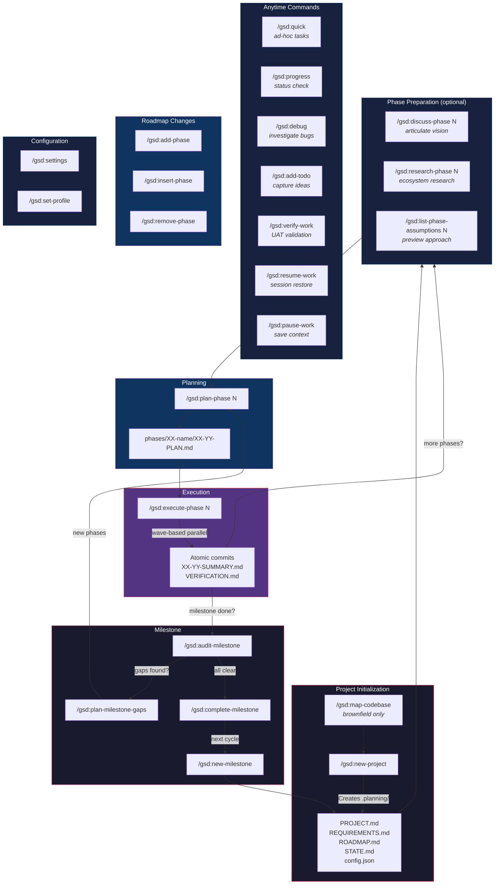

# GSD Workflow Diagram


```mermaid
flowchart TD
    subgraph INIT["Project Initialization"]
        MC["/gsd:map-codebase<br/><i>brownfield only</i>"]
        NP["/gsd:new-project"]
        MC -.-> NP
        NP --> |"Creates .planning/"| ARTIFACTS["PROJECT.md<br/>REQUIREMENTS.md<br/>ROADMAP.md<br/>STATE.md<br/>config.json"]
    end

    subgraph PHASE_PREP["Phase Preparation (optional)"]
        DP["/gsd:discuss-phase N<br/><i>articulate vision</i>"]
        RP["/gsd:research-phase N<br/><i>ecosystem research</i>"]
        LA["/gsd:list-phase-assumptions N<br/><i>preview approach</i>"]
    end

    subgraph PLAN["Planning"]
        PP["/gsd:plan-phase N"]
        PP --> PLAN_OUT["phases/XX-name/XX-YY-PLAN.md"]
    end

    subgraph EXEC["Execution"]
        EP["/gsd:execute-phase N"]
        EP --> |"wave-based parallel"| EXEC_OUT["Atomic commits<br/>XX-YY-SUMMARY.md<br/>VERIFICATION.md"]
    end

    subgraph MILESTONE["Milestone"]
        AM["/gsd:audit-milestone"]
        AM --> |"gaps found?"| PMG["/gsd:plan-milestone-gaps"]
        PMG --> |"new phases"| PP
        AM --> |"all clear"| CM["/gsd:complete-milestone"]
        CM --> |"next cycle"| NM["/gsd:new-milestone"]
        NM --> ARTIFACTS
    end

    ARTIFACTS --> PHASE_PREP
    PHASE_PREP --> PP
    PLAN_OUT --> EP
    EXEC_OUT --> |"more phases?"| PHASE_PREP
    EXEC_OUT --> |"milestone done?"| AM

    subgraph SIDE["Anytime Commands"]
        direction LR
        QK["/gsd:quick<br/><i>ad-hoc tasks</i>"]
        PR["/gsd:progress<br/><i>status check</i>"]
        DB["/gsd:debug<br/><i>investigate bugs</i>"]
        TD["/gsd:add-todo<br/><i>capture ideas</i>"]
        VW["/gsd:verify-work<br/><i>UAT validation</i>"]
        RW["/gsd:resume-work<br/><i>session restore</i>"]
        PW["/gsd:pause-work<br/><i>save context</i>"]
    end

    subgraph ROADMAP_MGMT["Roadmap Changes"]
        direction LR
        AP["/gsd:add-phase"]
        IP["/gsd:insert-phase"]
        RMP["/gsd:remove-phase"]
    end

    subgraph CONFIG["Configuration"]
        direction LR
        ST["/gsd:settings"]
        SP["/gsd:set-profile"]
    end

    style INIT fill:#1a1a2e,stroke:#e94560,color:#fff
    style PHASE_PREP fill:#16213e,stroke:#0f3460,color:#fff
    style PLAN fill:#0f3460,stroke:#533483,color:#fff
    style EXEC fill:#533483,stroke:#e94560,color:#fff
    style MILESTONE fill:#1a1a2e,stroke:#e94560,color:#fff
    style SIDE fill:#16213e,stroke:#0f3460,color:#fff
    style ROADMAP_MGMT fill:#0f3460,stroke:#533483,color:#fff
    style CONFIG fill:#16213e,stroke:#0f3460,color:#fff
```

## Core Loop

```
new-project → plan-phase → execute-phase → repeat → audit → complete-milestone → new-milestone
```
