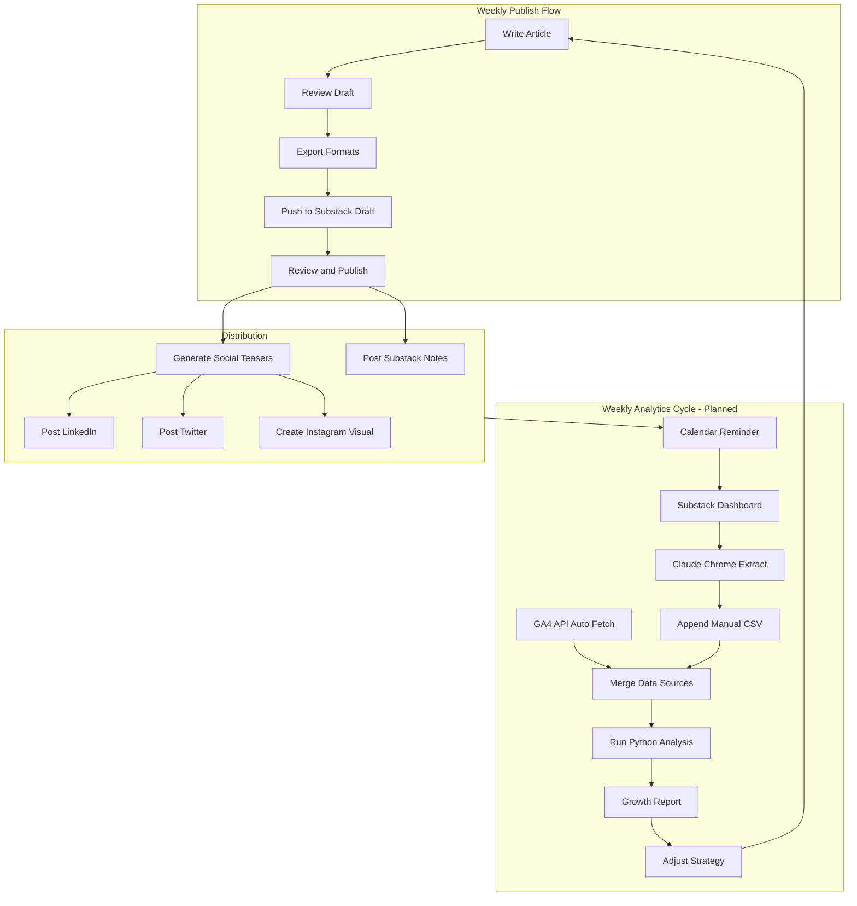

# Publishing Workflow

This document describes the end-to-end weekly process for publishing to **The AI Mirror** (Substack) and distributing to social channels. It is for the human author and for AI assistants that help draft, export, or cross-post.

**Related docs:** [MCP Server Setup](mcp-setup.md) (Substack, Crosspost, GA4) · [.ai/rules/publication.md](../.ai/rules/publication.md) (teaser conventions) · [templates/article.md](../templates/article.md) (front-matter) · [templates/social-teasers.md](../templates/social-teasers.md) (teaser drafting)

---

## Weekly Publishing Cycle

1. **Write and finalize** the article under `topics/<name>/artifacts/articles/` (or drafts subfolder). Use the article template; keep front-matter and body in sync.
2. **Export** formats (e.g. HTML/Markdown for Substack) with:
   ```bash
   ./scripts/export-all.sh <topic_name>
   ```
3. **Push draft to Substack**  
   - **MCP:** Use the Substack MCP tool `create_draft_post(title, subtitle, body)` with exported content.  
   - **Fallback:** Copy-paste from the exported file into a new Substack post in the dashboard.  
   - If the MCP fails (e.g. auth/session expired), re-extract credentials per [mcp-setup.md](mcp-setup.md) or use the manual paste method.
4. **Review and publish** in the Substack editor. Add cover image, adjust formatting, then publish. Fill in `publication_url` and `published_date` in the article's front-matter.
5. **Generate social teasers** using [templates/social-teasers.md](../templates/social-teasers.md). Draft platform-specific copy; copy final text into the article's `social_teasers` block (linkedin, twitter, instagram_caption, substack_notes).
6. **Distribute**
   - **LinkedIn & Twitter/X:** Crosspost MCP (if configured) or manual post with teaser + link.
   - **Instagram:** Manual only (no MCP support). Use caption from template; add visual or quote card; CTA to link in bio.
   - **Substack Notes:** Post the Substack Notes teaser manually from the Substack dashboard to leverage native discovery.

---

## Workflow Overview



The **analytics** subgraph is **planned** and will be implemented in Phase 5 (see [Analytics cycle (planned)](#analytics-cycle-planned) below).

---

## Analytics cycle (planned)

*Implemented in Phase 5. This section describes the intended flow.*

- **Automated:** GA4 API script pulls page views, traffic sources, referrals, and user behavior into CSV files. Optional: GA4 MCP for conversational queries in Cursor.
- **Semi-manual:** Weekly calendar reminder to open the Substack dashboard (and social analytics). Use the Claude Chrome plugin with a saved prompt to extract subscriber counts, email open/click rates, restacks, and social post engagement; append to CSV files in the repo.
- **Merge and report:** Python scripts merge GA4 + manual data and generate a weekly Markdown report for review.

Setup for GA4 and semi-manual collection (credentials, checklist, prompts) is documented in [mcp-setup.md](mcp-setup.md). Scripts and directory layout will live under `analytics/` once Phase 5 is complete.

---

## Growth Playbook

Flexible guidelines to support growth over time. Adopt what fits your cadence; adjust as you learn what works.

- **Substack Notes** — Post regularly (e.g. daily or several times per week) for organic discovery. Short teasers, links to articles, and genuine engagement with other writers’ notes help visibility.
- **Niche engagement** — Engage with writers in the AI / philosophy / spirituality space: read, comment, restack. Relationship-driven growth doesn’t scale via automation but does build a real audience.
- **Substack Recommendations** — Enable Recommendations for your publication and add cross-recommendation partners. Rotate or refresh partners periodically so more readers discover you.
- **Provocative hooks** — Use each article’s most surprising or provocative claim as the social hook (especially Twitter/X and LinkedIn). Exploratory tone still allows a strong opening line.
- **Experiment and track** — Try different teaser formats, lengths, and hashtags. Once Phase 5 analytics are in place, compare which channels and formats correlate with traffic and new subscribers; double down on what works.

---

## References

| Resource | Purpose |
|----------|---------|
| [docs/mcp-setup.md](mcp-setup.md) | Substack, Crosspost, and GA4 MCP setup; credential extraction; semi-manual collection |
| [.ai/rules/publication.md](../.ai/rules/publication.md) | Publication target, social channels, platform-specific teaser conventions |
| [templates/article.md](../templates/article.md) | Article front-matter (including `social_teasers`, `publication_url`, `published_date`) |
| [templates/social-teasers.md](../templates/social-teasers.md) | Teaser drafting template with examples and fill-in blocks |
